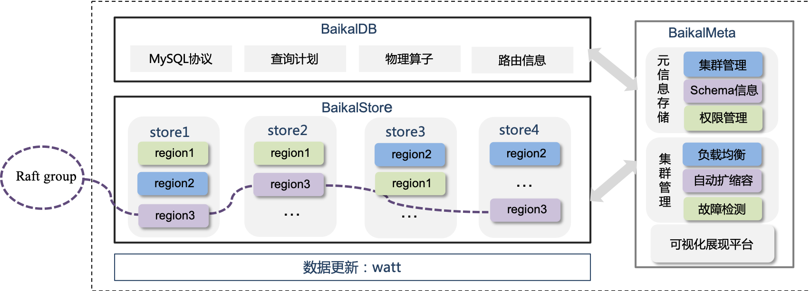

[中文版](README_cn.md) \|[20181225前BaikalStore升级须知](https://github.com/baidu/BaikalDB/wiki/Upgrade-BaikalStore)

# Introduction BaikalDB
BaikalDB is a distributed enhanced structured database system.
It supports sequential and randomised realtime read/write of structural data in petabytes-scale.
BaikalDB is compatible with MySQL protocol and it supports MySQL style SQL dialect, by which users can migrate their data storage from MySQL to BaikalDB seamlessly.

BaikalDB internally provides projections, filter operators (corresponding with SQL WHERE or HAVING clause), aggregation operators (corresponding with GROPY BY clause) and sort operators (corresponding with SQL ORDER BY), with which users can fulfill their complex and time-critical anayltical and transational requirement by writing SQL statements. In a typical scenario, hundreds of millions of rows can be scanned and aggregated in few seconds.
BaikalDB also supports full-text search by building inverted indices after words segmentation. 
Users can harness fuzzy search feature simply by adding a `FULLTEXT KEY` type index when creating tables and then use LIKE clause in their queries.

BaikalDB uses share-nothing architecture. All three components (BaikalDB/BaikalMeta/BaikalStore) can be deployed in containers (like docker or kubernetes) with ease.
BaikalDB features multi-tenant isolation by:
* binding each user with a specific NAMESPACE; user can only access databases and tables within this NAMESPACE.
* associating each table to a resource tag; table regions will be allocated only on baikalStore instances with this resource tag.
* defining user's privileges (read-only or read-write) to access databases and tables.

Below is a summary of BaikalDB key features:
* Multi-Replica High Avalibility. All user data and meta data are stored in three replicas across diffrent machines or diffrent geo-zones. In case of node corruption, data on the corrupted node will be migrated to healthy nodes. 
* Strong consistency. Multi-Raft consensus algorithm (we use the [braft](https://github.com/brpc/braft) implementation) is used to ensure multi-replica data consistency.
* State-Free Horizontal scalability. For more storage space of a BaikalDB cluster, new nodes can be added to the cluster with ease. Load Balancer will then take the new added nodes into consideration and migrate region replicas from busy nodes to idle nodes automatically.
* MySQL Compatibility. BaikalDB supports MySQL client-server protocol and a subset of MySQL dialect of query language, including Select, Select...Join, Insert, Delete, Replace, Update, Create Table, Create Database, etc. It also supports dynamic adding or deleting fields for a table without refreshing the table data.
Users can migrate their data from MySQL to BaikalDB with very low cost, while saving the cost of manually sharding the tables when data grows larger.
* Ease of Deployment. BaikalDB has a list of sophisticated startup options (using gflags), but most of them can keep default for nomal usage. Deploying a BaikalDB cluster contains a few very simple steps. We deploy BaikalDB in hundreds of containers inside Baidu private cloud.
* Multi-Tenant Data Isolation. For typical usage, multiple BaikalStore clusters with different resouce tags can be deployed to share a single BaikalMeta and BaikalDB cluster, and users can only access databases and tables with specific resource tags.

Above is the BaikalDB architecture figure, in which,
* BaikalStore stores the table data. Data within a table may be partitioned into multiple regions, and each region is a Raft group, which has three peers located in different nodes. A peer can be migrated from one nodes to another for better load balance or data recovery after node crash.
* BaikalMeta stores the meta data for baikalStore, including table schema, region info, user info, database info, baikalStore instance status, etc. BaikalMeta itself is a raft group for meta data safety and consistency. Typically three BaikalMeta instances (replicas) is required for online product usage.
* BaikalDB is responsible for query parsing, planning and executing. BaikalDB is stateless and we can deploy as many BaikalDB instance as required by the scale of query workloads. 

